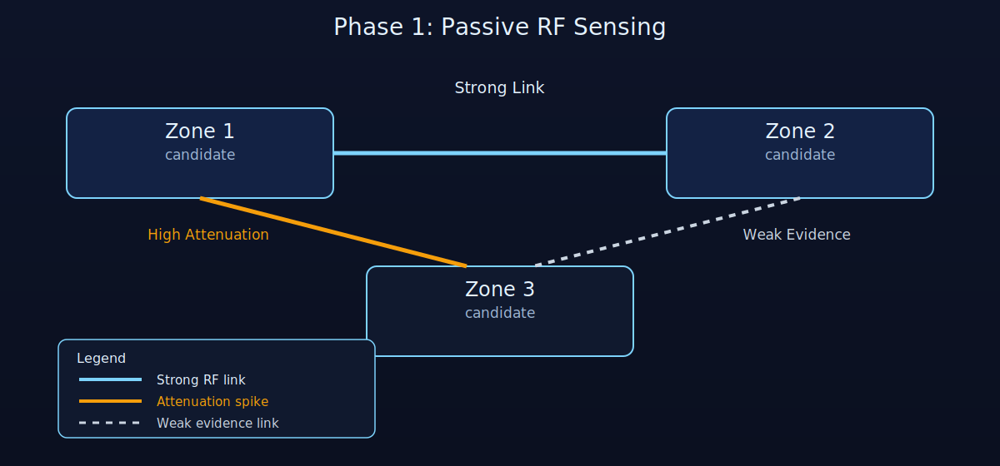
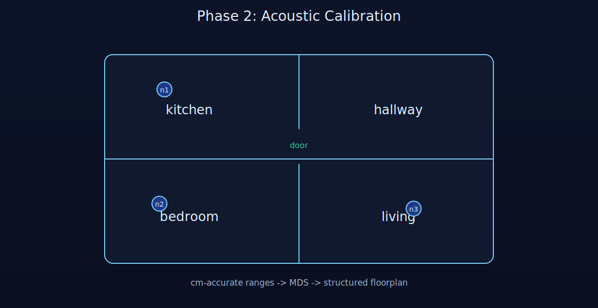
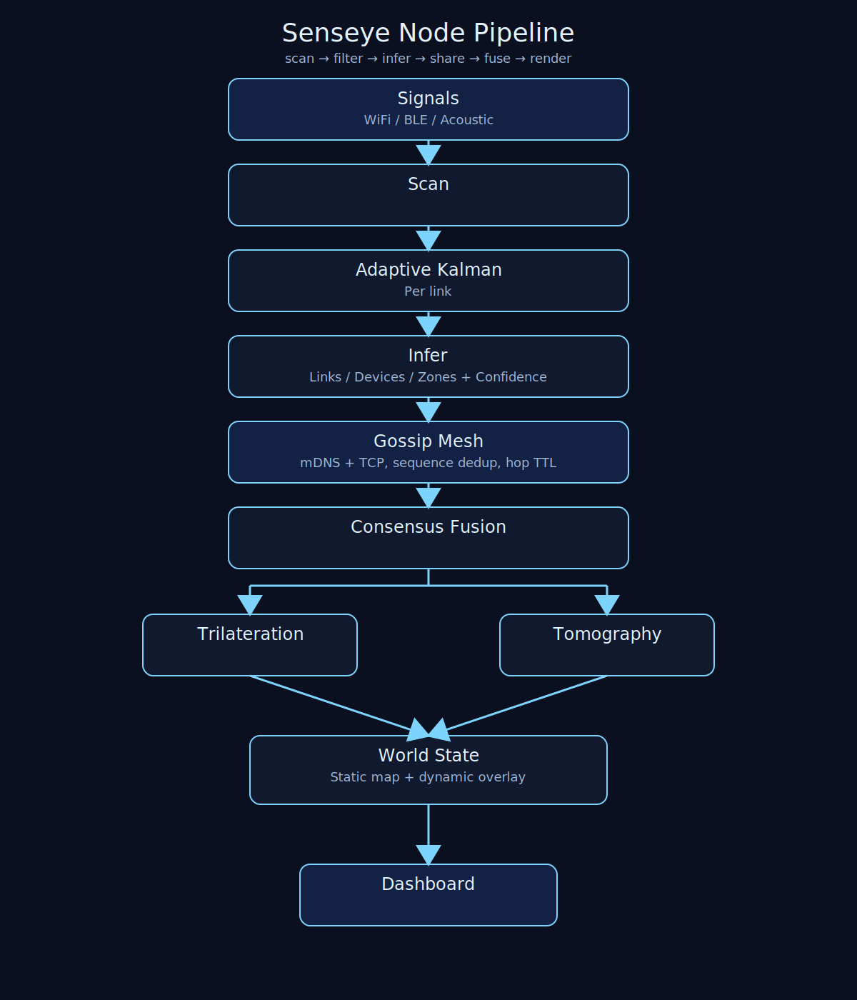
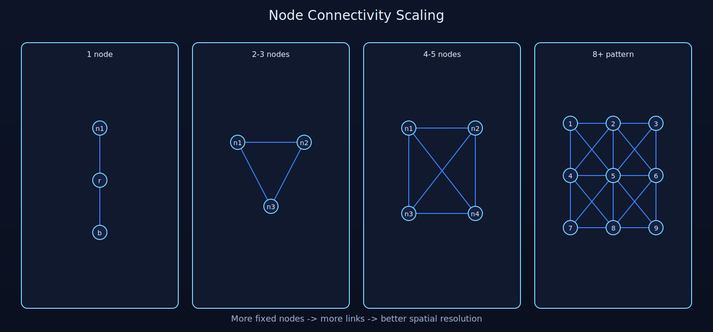

# senseye

Weekend prototype for fun: a state-of-the-art sensor-fusion demo for room mapping and motion tracking. Built with help from Claude, Codex, and Antigravity. Please do not embed this in my thermostat or smoke detector.

Distributed RF/acoustic sensing for indoor floorplan mapping and live motion inference.

Senseye builds a static floorplan from WiFi/BLE/acoustic structure and overlays dynamic motion/device estimates in real time.

Senseye uses:

- Adaptive **2-state Kalman filtering** per link (`rssi`, `rssi_rate`) with Joseph-form covariance update and innovation-based process-noise scaling
- Confidence-aware local inference (sample support + innovation penalty + acoustic SNR)
- **Inverse-variance consensus** fusion across links, devices, and zones with consistent `c/(1-c)` precision weighting
- Robust weighted trilateration with Tukey biweight outlier suppression and inlier refit
- Inverse-variance-weighted ridge tomography with adaptive regularization
- Gossip relay with `sequence_number` dedup and `hop_count` TTL

For full derivations and equations, see [DESIGN.md](DESIGN.md).

## How it works

Each node runs: **scan** → **filter** → **infer** → **share** → **fuse** → **render**

### PHASE 1: passive RF sensing (automatic, continuous)

All nodes scan WiFi + BLE. Kalman-filtered RSSI gives distance estimates, attenuation reveals walls.



### PHASE 2: acoustic calibration (on demand)

User triggers: `senseye calibrate`
All fixed nodes chirp in sequence (~30 seconds)
→ precise distance matrix (cm-accurate)
→ MDS gives accurate layout
→ echo profiles give room dimensions
→ wall positions snap into focus



### PHASE 3: motion-refined (passive, over hours)

Zone transitions from device tracking refine room connectivity.
Doorways discovered from repeated cross-room movement patterns.


### Node pipeline

Each node runs the same code. Beliefs flow through the gossip mesh into shared fusion.



_Generated from `scripts/generate_node_pipeline_asset.py`._

## Adding nodes

Any device that can run Python is a node. More nodes = more signal paths = better resolution.

Approximate pairwise link growth (complete graph assumption): `links = N(N-1)/2`



_Additional diagrams are generated from `scripts/generate_readme_graph_assets.py`._

| Nodes | Signal paths | What you get |
|-------|-------------|-------------|
| 1 | sparse | Motion detection to router + BLE devices |
| 2-3 | basic mesh | Zone-level tracking, room connectivity |
| 4-5 | 6-10 links | Rough floor plan, directional motion |
| 8+ | 28+ links | Detailed room shapes, sub-room localization |

## Quick start

```bash
# UI + sensing
uv run senseye

# Headless sensor node
uv run senseye --headless --role fixed --name kitchen

# Calibrate the map (acoustic ping sequence)
uv run senseye calibrate

# Interval acoustic mode
uv run senseye --acoustic 10m
```

## Acoustic mode

Nodes with speakers and microphones can ping each other ultrasonically (18-22kHz, inaudible) for centimeter-accurate distance measurement.

Each audio-capable node also has a deterministic acoustic signature channel derived from `node_id` (hash-bucketed into 6 ultrasonic 1 kHz bands from 17-23 kHz). During peer ranging, listeners match against the expected peer signature band to identify emitters and reduce cross-node confusion.

Direct peer acoustic ranges are gossiped and can be daisy-chained (bounded hop shortest paths) during calibration to propagate local measurements across the node graph when a direct pair measurement is missing.

```bash
uv run senseye --acoustic off         # no chirps (default)
uv run senseye --acoustic on-demand   # only during calibration
uv run senseye --acoustic 10m         # ping every 10 minutes
uv run senseye --acoustic 1h          # ping every hour
```

## Architecture

```
senseye/
    node/           # scan, filter, infer, peer, belief
    fusion/         # consensus, trilateration, tomography
    mapping/
        static/     # walls, rooms, topology (built once, refined rarely)
        dynamic/    # device positions, motion (updated every second)
    ui/             # terminal dashboard
    calibration.py  # active map calibration
    config.py       # runtime configuration
    protocol.py     # wire format (newline-delimited JSON over TCP)
    main.py         # entry point
```

## Next steps

1. Harden the new acoustic daisy-chain flow into synchronized full-mesh calibration rounds so every node pair gets repeated direct measurements when possible.
2. Add calibration quality gates (SNR thresholds, ToF sanity checks, and geometric consistency checks) and surface a calibration confidence score in the UI.
3. Improve acoustic signature scalability with more channels and chirp-code separation so larger node counts have fewer collisions.
4. Replace fixed RF model constants with per-node/per-environment calibration (`PATHLOSS_N`, intercept) learned during setup.
5. Propagate uncertainty end-to-end into map and topology updates so low-confidence estimates are explicitly down-weighted in final outputs.
6. Add a reproducible benchmark harness with logged datasets and metrics (layout error, device-position RMSE, motion/occupancy precision-recall).

## Requirements

- Python 3.11+
- macOS or Linux
- WiFi and/or BLE hardware
- Optional: speaker + mic for acoustic mode
